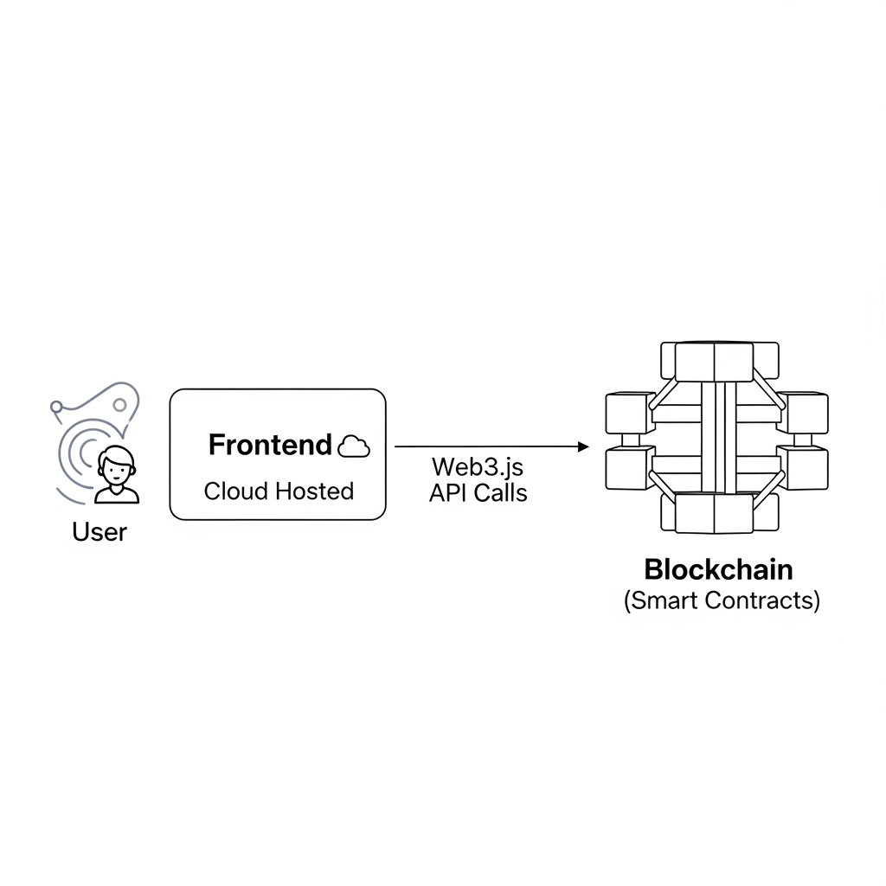

  
  <h1>EtherMarket: Marketplace Descentralizado na Ethereum</h1>
  
Um dApp de marketplace para compra e venda 
de produtos, construído como um projeto de estudo para explorar o ecossistema da blockchain Ethereum.

  
  
  
  
  
  

---

## 📋 Índice

- [Sobre o Projeto](#-sobre-o-projeto)
  - [Objetivo](#objetivo)
  - [Demonstração Visual](#-demonstração-visual)
- [🏛️ Arquitetura do Sistema](#️-arquitetura-do-sistema)
- [🛠️ Tecnologias Utilizadas](#️-tecnologias-utilizadas)
- [🚀 Demonstração Online](#-demonstração-online)
- [🏁 Começando (Getting Started)](#-começando-getting-started)
  - [Pré-requisitos](#pré-requisitos)
  - [Guia de Instalação](#guia-de-instalação)
- [👨‍💻 Uso da Aplicação](#-uso-da-aplicação)
  - [Conectando a Carteira](#1-conectando-a-carteira)
  - [Comprando um Produto](#2-comprando-um-produto)
- [✨ Trechos de Código (Code Snippets)](#-trechos-de-código-code-snippets)
  - [Função de Compra no Smart Contract](#função-de-compra-no-smart-contract-solidity)
  - [Interação com o Contrato no Frontend](#interação-com-o-contrato-no-frontend-react--web3js)
- [👤 Autor](#-autor)

---

## 📖 Sobre o Projeto

O **EtherMarket** é uma Aplicação Descentralizada (dApp) que simula um ambiente de marketplace. Usuários podem conectar suas carteiras digitais (como a MetaMask) para visualizar e "comprar" produtos listados.

### Objetivo

Este é um **projeto de estudo** criado com o objetivo de aplicar e aprofundar conhecimentos práticos em todo o ciclo de vida de um dApp, incluindo:

-   **Desenvolvimento de Smart Contracts:** Escrita, teste e deploy de contratos inteligentes na linguagem Solidity.
-   **Infraestrutura Blockchain:** Configuração de uma rede de teste privada na nuvem (Azure) usando Ganache CLI para simular o ambiente Ethereum.
-   **Integração Frontend (Web3):** Conexão de uma interface de usuário (React) com a blockchain para ler dados e submeter transações.
-   **Boas Práticas de Desenvolvimento:** Utilização de ferramentas padrão da indústria como o Truffle Suite para gestão do ciclo de vida dos contratos.

O projeto não utiliza a rede principal (mainnet) do Ethereum e não envolve valores financeiros reais.

### 📸 Demonstração Visual

Abaixo, uma visão geral da interface principal da aplicação:

---

## 🏛️ Arquitetura do Sistema

A aplicação foi projetada com componentes desacoplados, seguindo uma arquitetura moderna para dApps. O diagrama abaixo ilustra o fluxo de interação:

## 🛠️ Tecnologias Utilizadas

Este projeto foi construído com algumas das ferramentas mais populares do ecossistema de desenvolvimento web e blockchain:

| Tecnologia | Descrição |
| :--- | :--- |
| **React** | Biblioteca JavaScript para construir a interface de usuário. |
| **Solidity** | Linguagem de programação para escrever os smart contracts. |
| **Ethereum** | Plataforma blockchain na qual a aplicação é conceitualmente baseada. |
| **Truffle Suite** | Ambiente de desenvolvimento, teste e deploy para smart contracts. |
| **Ganache CLI** | Simulador de blockchain Ethereum local/privado para desenvolvimento. |
| **Web3.js** | Biblioteca para conectar o frontend aos smart contracts na blockchain. |
| **Node.js** | Ambiente de execução JavaScript para o servidor de desenvolvimento. |
| **Microsoft Azure** | Plataforma de nuvem onde a instância do Ganache foi hospedada em um container. |
| **Render** | Plataforma de nuvem para hospedagem gratuita do frontend. |
| **MetaMask** | Carteira de criptomoedas utilizada para interagir com o dApp. |

---

## 🚀 Demonstração Online

A aplicação está disponível para teste e demonstração. Acesse o link abaixo e sinta-se à vontade para interagir com o marketplace!

➡️ **[Acessar a Demo do EtherMarket](https://blockchain-dapp-hzfn.onrender.com/)** ⬅️

**Atenção:** Como a aplicação se conecta a uma rede de teste privada, talvez seja necessário configurar sua MetaMask para se conectar a ela. Para uma experiência simplificada, siga o guia de [Uso da Aplicação](#-uso-da-aplicação).
